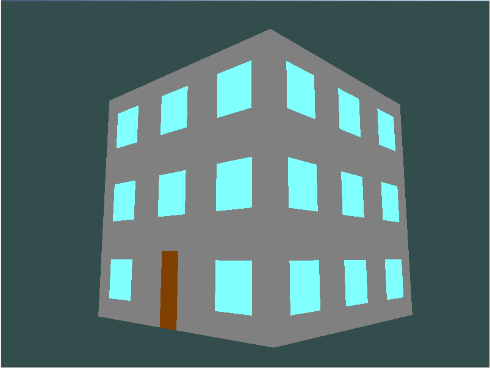
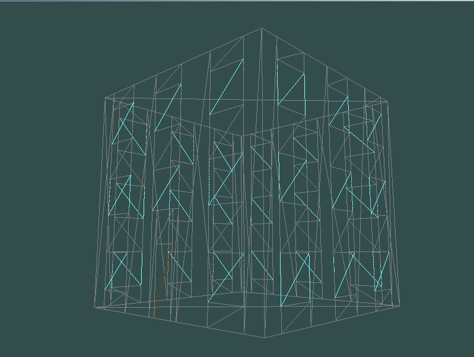
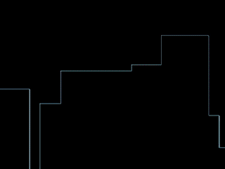
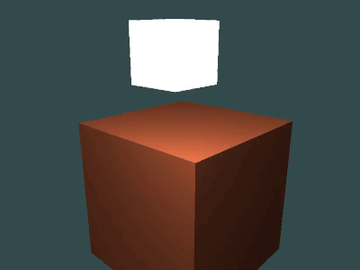

# OpenGL-projects

Small projects made while learning OpenGL (3.3). Each project is made using GLFW for window management, 
GLEW for OpenGL extension management, GLM for OpenGL maths and stbi_image.h for image loading.  

The core of most of the projects were created while following the tutorials found at [LearnOpenGL](http://learnOpenGL.com).  

####Building example:
  
  
Manually created using 346 vertices and a total of 206 triangles.  
  
####Shader fade to black:
  
Using shaders to recolour the scene to give it a sense of doom.  

####Lighting cube example:
  
Example of using shaders in a 3D scene with lighting.
